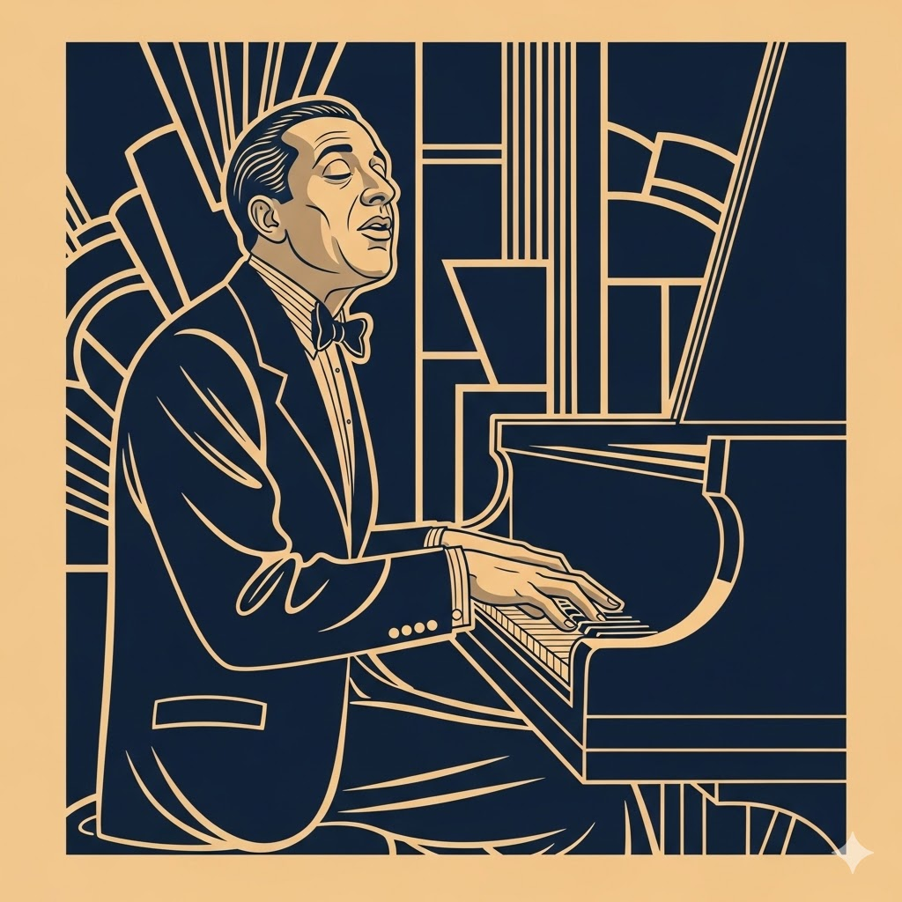

# [Music] 시대를 관통하는 선율: 나의 재즈 연대기

## 📌 Metadata

- **Category:** #Music #Jazz #History
    
- **Artist List:** George Gershwin, Dave Brubeck, Sarah Vaughan, Ella Fitzgerald, Bill Evans, Chet Baker, John Coltrane, Lisa Ono, Keith Jarrett, Chuck Mangione
    
- **Created:** 2026-03-12
    

---

## 🎷 재즈의 역사와 나의 취향

### 1. 클래식과 재즈의 가교: 조지 거쉰 (George Gershwin)
- 
- **대표곡:** _[Rhapsody in Blue](https://www.youtube.com/watch?v=0U-IXWaapx4)_, _Cuban Overture_
    
- **Behind Story:** 거쉰은 재즈를 단순한 유행가가 아닌 '미국의 예술 음악'으로 격상시키려 노력했습니다. <랩소디 인 블루>의 상징인 도입부 클라리넷 글리산도는 사실 연습 중 연주자가 장난스럽게 연주한 것을 거쉰이 마음에 들어 하여 곡에 정식으로 포함시킨 것입니다.
    

### 2. 지적인 빅밴드: 데이브 브루벡 (Dave Brubeck)

- **대표곡:** _Take Five_, _Blue Rondo à la Turk_
    
- **Behind Story:** 브루벡의 콰르텟은 당시로서는 파격적인 변박자를 사용했습니다. 특히 <Take Five>는 5/4박자라는 생소한 리듬임에도 불구하고 역사상 가장 많이 팔린 재즈 싱글 중 하나가 되었습니다. 그는 인종 차별에 반대하며 흑인 연주자들과 함께 무대에 서기 위해 공연을 취소하는 등 사회적 목소리를 낸 음악가이기도 합니다.
    

### 3. 보컬의 전설: 사라 본 & 엘라 피츠제럴드

- **대표곡:** _Misty_ (Ella), _Lullaby of Birdland_ (Sarah)
    
- **Behind Story:** 엘라 피츠제럴드는 악보를 읽지 못했지만 천재적인 청각과 기억력으로 악기보다 더 정교한 '스캣'을 구사했습니다. 사라 본은 'The Divine One'이라는 별명답게 3옥타브를 넘나드는 성악가적 가창력으로 재즈 보컬의 위상을 높였습니다.
    

### 4. 쿨 재즈의 고독: 빌 에반스 & 쳇 베이커

- **대표곡:** _Waltz for Debby_ (Bill), _I Fall in Love Too Easily_ (Chet)
    
- **Behind Story:** 빌 에반스는 클래식의 섬세한 터치를 재즈 트리오에 도입하여 현대 재즈 피아노의 기틀을 닦았습니다. 쳇 베이커는 '재즈계의 제임스 딘'이라 불릴 만큼 수려한 외모와 우울한 트럼펫 선율로 큰 인기를 끌었으나, 평생 약물 중독과 싸워야 했던 비극적인 삶을 살았습니다.
    

### 5. 구도자의 소리: 존 콜트레인 (John Coltrane)

- **대표곡:** _In a Sentimental Mood_, _My Favorite Things_
    
- **Behind Story:** 콜트레인은 음악을 통해 영적인 해방을 갈구했습니다. 그는 하루 10시간 이상 연습에 매진하는 연습벌레로 유명했으며, <My Favorite Things>는 영화 사운드트랙을 재즈로 재해석하여 대중과 예술성 사이의 완벽한 균형을 맞춘 걸작입니다.
    

### 6. 보사노바의 편안함: 리사 오노 (Lisa Ono)

- **대표곡:** _I Wish You Love_, _The Girl From Ipanema_
    
- **Behind Story:** 브라질 상파울루에서 태어난 리사 오노는 일본으로 건너와 보사노바의 대중화를 이끌었습니다. 그녀의 나직하게 읊조리는 창법은 '치유의 음악'이라는 별명을 얻으며 전 세계적인 사랑을 받았습니다.
    

### 7. 경계를 넘어선 거장: 키스 자렛 & 척 맨지오니

- **대표곡:** _My Song_ (Keith), _Feel So Good_ (Chuck)
    
- **Behind Story:** 키스 자렛의 <My Song>은 노르웨이의 색소폰 연주자 얀 가바렉과의 협업으로 탄생한 '유러피안 재즈'의 정수입니다. 척 맨지오니는 트럼펫보다 더 부드러운 소리를 내는 '플루겔혼'을 주력으로 사용하여 재즈가 어렵다는 편견을 깼습니다.
    

---

## 🔗 Related Notes

- [[Jazz History]]
    
- [[Music Theory]]
    
- [[Artist Research]]
    

---

_Generated by Gemini Assistant for Obsidian Workflow._